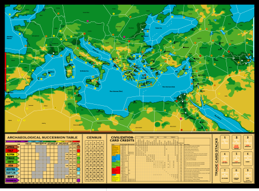
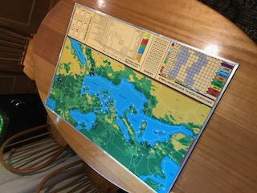

# Civilization Board Game Map

A reboot of the Advanced Civilization Board Game Map

N.B., this is nothing to do with the Computer Games or the board game
based on the computer games.

### General

I wanted a map very like the original map from the Avalon Hill board
game Advanced Civilization with the Western Map extension.

I know there are some versions out there, but generally they are bit
maps of varying resolutions. My aim here was to create an SVG, so I
could play with it a little. For instance I have added names for
provinces (more on that later), and the colors are (I think) a little
brighter.

The plan is to print it, and then glue it down to MDF (5mm), in two
pieces so I have a pretty durable version. I'll post some photos when
its done.

And I thought others might like having the SVG version to create their
own mods.

### Modifcations from the original

Mostly I have tried to follow the original map though a lot by eye so
I won't apologise if it varies a little, but I have made what I
consider to be few improvements (they make some things a little easier
to see or work with). You may not like the mods or may want to go
further, but that's why its a SVG, so you can change it.

Small Mods:

  + Colors are slightly different.
  + Population counts are black on color to make them more readable.
  + Volcanos are in red instead of white to make them easier to see.
  + Markers for cities are slightly larger.
  + I have added the AST to the board, made it bigger to fit, and used
    the extra space to rearrange things, and add a table of the Civ cards. 
  + Added rivers to river-valleys.

The biggest mod is to add city names, and province names for provinces
without a city. It makes it easier to discuss the map. The names are
attempts at historical names, but the province boundaries don't always
match up nicely. There are also a mish-mash of names: many Roman, for
obvious reasons, but some Greek, and a few others. I also added river
names, both for new rivers, and for the major rivers used as borders.

I had to move a couple of cities to make them match anything I could
find (Gades for instance).

I'm interested in whether people have some better choices for such names. 
 
The other biggish mod is to add an extra country to the AST
(Phoenicia) with a view to allowing someone to play with adding
this. I picked Phoenicia because you could start them almost anywhere
around the Med.

### Instructions

There is a PDF version for people who just want to print it off. Its
set up for A0 paper, though there is plenty of spare room to print on
some other format, or to scale up if you want a really big version.

The SVG is an Inkscape SVG, so for best results I suggest using
Inkscape (its free and multiplatform, and pretty nice to use).

Most of the components are on a layer. Hopefully the names are fairly
obvious. You could drop all of the text by dropping the appropriate layer.

The colours are mostly labelled as well, so it should be pretty
trivial to play with the map colours.

I have put a black boarder around the edge, for my own printout, and
some extra marks and measurements to help in gluing it to a board. You
may want to get rid of them or not.

Also, it should be trivial to rescale it to whatever size suits,
starting from the SVG (that's the nice thing about SVGs as opposed to
bit maps).

If you want to add your remix to the repo, then we should be able to
manage that as well.

The PNG (bit map) isn't intended to be printed, its just a picture to
illustrate the map for the repo.

### DIY Example

OK, here's the final version:

Details:

+ It was printed out on A0 paper, then cut to size, and then cut in
half so that I would have board that was small enough to store.
+ I glued the two parts (with spray adhesive) to 2 sheets of
3mm MDF. The MDF was cut to the actual size of the final map, so there
was an overlap around the edges, with I glued down separately.
+ The optional part was putting 5mm aluminium channel (with an inner
dado of almost exactly 3mm) around the edges. This gives the edge a
bit more protection, but also, I cut the channel on one board about
1cm longer than the edge, and the other 1cm shorter. This means that
when assembled, the channel helps hold the two pieces together. 

### Final stuff

Obviously this is based on Avalon Hill content, and I am happy to
remove it, if anyone cares. The only reason I think it is reasonable
to put it up here is that as far as I know, its way out of print, and
almost impossible to get hold of (except for other perhaps dubious
quality reprinted boards).

